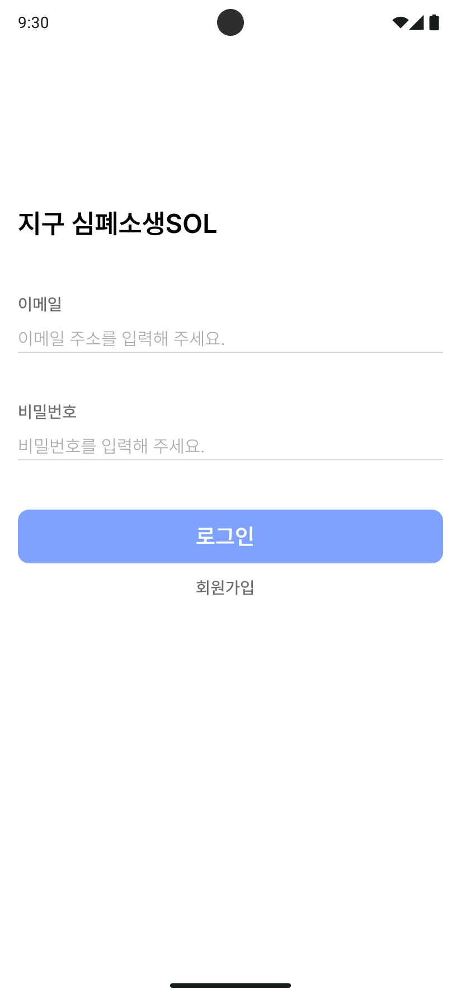
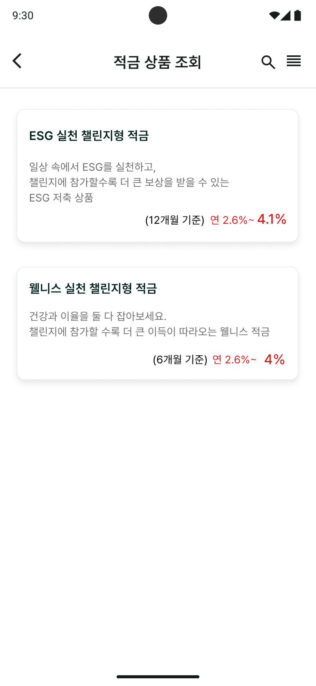
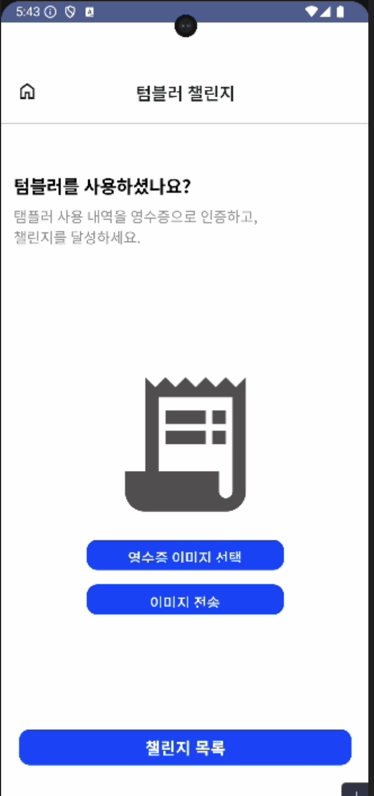
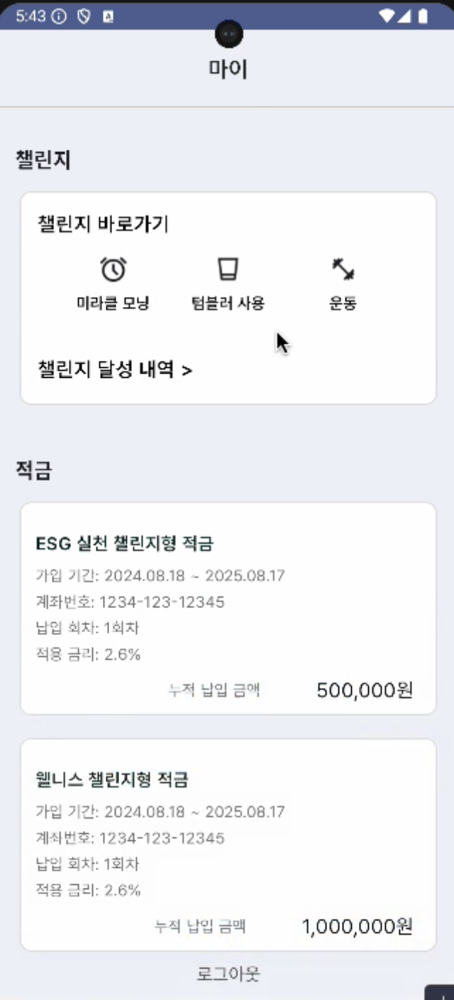
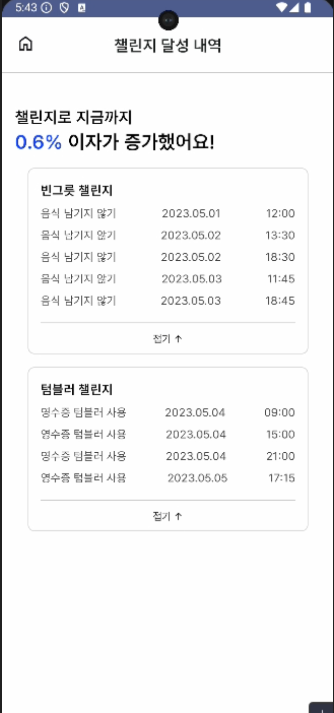

# EarthCPR FE

이 프로젝트는 Kotlin과 Android를 사용하여 프론트엔드를 개발했으며, REST API와 Retrofit을 활용하여 백엔드와의 통신을 구현했습니다.

## 기술 스택

- **언어**: Kotlin
- **프레임워크**: Android
- **네트워킹**: Retrofit
- **백엔드 통신**: REST API

## 실행 방법

프로젝트를 클론하여 안드로이드 스튜디오를 통해 실행할 수 있습니다.

```bash
https://github.com/EARTH-CPR/Frontend.git
cd Frontend
```

## 실행 화면
#### 로그인 화면


#### 적금 화면


#### 챌린지 인증화면


#### 마이페이지


#### 챌린지 성공 내역

