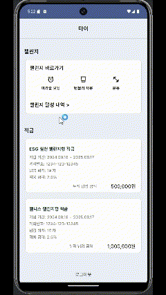

# 🌍 지구 심폐소생SOL (Earth CPR)

지구를 지키고 건강을 챙기는 동시에 적금을 통해 재정적 목표를 달성할 수 있는 프로젝트입니다. ESG(환경, 사회, 지배구조)와 웰니스(건강과 행복)를 중심으로 한 적금 관리 및 챌린지 기능을 통해 브랜드 가치를 높이는 데 기여합니다.<br/>
[🌐 프론트엔드 Repository](https://github.com/EARTH-CPR/Frontend)<br/>
[🌐 백엔드 Repository](https://github.com/EARTH-CPR/Backend)<br/>
[🌐 AI Repository](https://github.com/EARTH-CPR/AI)<br/>

## 🔑 핵심 기능

### 🏦 적금 관리

- **적금 상품 등록**: 신한은행에서 제공하는 ESG 적금과 웰니스 적금을 선택하여 등록합니다.
- **적금 계좌 생성**: 사용자는 선택한 ESG 적금 또는 웰니스 적금을 바탕으로 적금 계좌를 개설할 수 있습니다.
- **적금 관리**:
  - **적금 납입 회차 조회**: 납입한 적금의 회차를 확인합니다.
  - **적금 중도 해지 이자 조회**: 중도 해지 시 발생하는 이자를 조회합니다.
  - **적금 계좌 해지**: 적금 계좌를 해지할 수 있습니다.
  - **계좌이체**: 적금 만기 또는 해지 시 송금을 진행합니다.
- **우대금리**: 챌린지 참여를 통해 우대금리를 적용받을 수 있습니다.

### 💪 챌린지

- **챌린지 선택**: 다양한 챌린지 중 자신에게 맞는 챌린지를 선택하여 참여합니다.
- **인증 방식**: 각 챌린지에 맞는 인증 방식을 통해 활동을 인증합니다.
- **변동 이율 적용**: 챌린지 인증이 완료되면 적금에 변동 이율이 적용됩니다.

#### 🧩 퀴즈 챌린지

- **ESG & 웰니스 퀴즈**: 환경, 성 평등, 프라이버시, 건강지식 관련 문제를 풀고 일정 점수 이상 득점 시 배지를 획득합니다.
  
#### 📸 인증 챌린지

- **ESG 적금 챌린지**:
  - **대중교통 이용**: 대중교통을 이용한 영수증을 제출하여 인증.
  - **텀블러 사용**: 텀블러 사용 영수증을 통해 인증 후 AI로 검증.
  - **음식 남기지 않기 (빈그릇 챌린지)**: 음식을 남기지 않고 빈 그릇 사진으로 인증 후 AI로 검증.
  
- **웰니스 적금 챌린지**:
  - **운동 인증**: 헬스장 이용 또는 개인 운동을 인증 후 AI로 검증.
  - **미라클 모닝 (아침 일찍 일어나기)**: 정해진 시간 전에 일어난 것을 인증.

## 요구사항 분석
<details>
  <summary>클릭하시면 요구사항 명세를 확인하실 수 있습니다.</summary>
  <div markdown="1">
    
| 요구기능 | 상세기능 | 요청번호 | 기능내용 | 비고 |
| --------| -- |---- | ---  |---- |
| 메인 | 메인화면 | HOM01 | 홈페이지의 메인 화면을 표시하여 사용자에게 주요 정보를 제공한다 |  |
| 회원 | 로그인 | USR01 | 로그인 기능 제공 |  |
|  | 회원가입 | USR02 | 회원가입 기능 제공 |  |
|  | 회원정보 수정 | USR03 | 회원정보 수정 기능 제공 |  |
| 친구 | 친구관리 | FRD01 | 친구 추가와 삭제 기능 제공 |  |
|  | 친구 깨우기 | FRD02 | 친구를 깨울 수 있는 알림 기능 제공 |  |
|  | 순위 보기 | FRD03 | 친구들 간의 순위를 볼 수 있는 기능 제공 |  |
| 적금 | 적금 생성 | SAV01 | 관리자가 새로운 적금을 생성할 수 있는 기능 제공 | 관리자 |
|  | 적금 가입 | SAV02 | 적금 가입 기능 제공 |  |
|  | 적금 관리 | SAV03 | 자신이 가입한 적금을 관리할 수 있는 기능 제공 |  |
| 챌린지 | 챌린지 생성 | CHL01 | 관리자가 새로운 챌린지를 생성할 수 있는 기능 제공 | 관리자 |
|  | 챌린지 등록 | CHL02 | 챌린지에 참여할 수 있도록 등록하는 기능 제공 |  |
|  | 챌린지 검증 | CHL03 | 챌린지의 진행 상태와 성공 여부를 검증하는 기능 제공 |  |
|  | 뱃지 관리 | CHL04 | 챌린지 성과에 따라 뱃지를 관리하고 보여주는 기능 제공 |  |
  </div>
</details>


## 시스템 아키텍쳐


[FE] 
<ul>
<li>Figma를 활용한 UI/UX 설계</li>
<li>Kotlin을 활용한 android 어플리케이션 개발</li>
</ul>
[BE]
<ul>
<li>Spring boot를 활용한 REST API 배포</li>
<li>Docker CI/CD를 활용한 test 및 배포</li>
</ul>
[AI]
<ul>
<li>Local 환경에서 학습한 model을 EC2 위에서 Flask를 통해 REST API로 제공</li>
</ul>

## ERD


# EarthCPR FE

이 프로젝트는 Kotlin과 Android를 사용하여 프론트엔드를 개발했으며, REST API와 Retrofit을 활용하여 백엔드와의 통신을 구현했습니다.
신한은행 API 사용 종료 이후, 목데이터를 이용해 화면 구현을 할 수 있도록 리팩토링하였습니다.

## 기술 스택

- **언어**: Kotlin
- **프레임워크**: Android
- **네트워킹**: Retrofit
- **백엔드 통신**: REST API

## 실행 방법

프로젝트를 클론하여 안드로이드 스튜디오를 통해 실행할 수 있습니다.

```bash
https://github.com/EARTH-CPR/Frontend.git
cd Frontend
```

## 실행 화면
#### 회원가입 [담당: 박가희]


#### 로그인 및 적금 유무별 화면 렌더링 변화 [담당: 박가희]
##### 사용자가 가입된 적금이 있는 경우


##### 사용자가 가입된 적금이 없는 경우


#### 사용자가 가입한 적금 목록 및 챌린지 조회 [담당: 박가희]


##### 홈 화면에서 바로 챌린지 확인하기


#### 적금 상품 목록 조회 [담당: 박가희]


#### 단계별 적금 가입하기 [담당: 박가희]


1. 적금 상품 선택 <br>
2. 가입할 예적금 계좌 선택 <br>
3. 적금 가입 금액 선택 <br>
4. 적금 가입 기간 선택 <br>
5. 완료 및 방금 가입한 적금 정보 확인 화면 렌더링 <br>
6. 챌린지 인증 이미지 업로드,전송 및 검증 화면 ( 미라클 모닝 > 텀블러 > 운동 순서 ) <br> 

#### 챌린지 인증 및 검증
##### 챌린지 인증 페이지 접근 > 이미지 업로드,전송 및 검증 
##### 미라클 모닝 챌린지 검증
 

##### 텀블러 챌린지 검증


##### 운동 챌린지 검증


