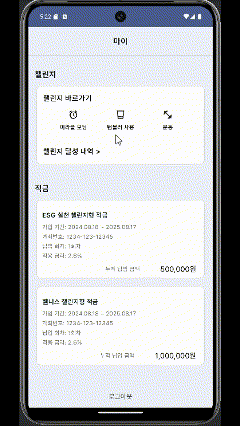
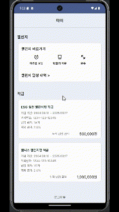

# EarthCPR FE

이 프로젝트는 Kotlin과 Android를 사용하여 프론트엔드를 개발했으며, REST API와 Retrofit을 활용하여 백엔드와의 통신을 구현했습니다.
신한은행 API 사용 종료 이후, 목데이터를 이용해 화면 구현을 할 수 있도록 리팩토링하였습니다.

## 기술 스택

- **언어**: Kotlin
- **프레임워크**: Android
- **네트워킹**: Retrofit
- **백엔드 통신**: REST API

## 실행 방법

프로젝트를 클론하여 안드로이드 스튜디오를 통해 실행할 수 있습니다.

```bash
https://github.com/EARTH-CPR/Frontend.git
cd Frontend
```

## 실행 화면
#### 회원가입


#### 로그인 및 적금 유무별 화면 렌더링 변화
##### 사용자가 가입된 적금이 있는 경우


##### 사용자가 가입된 적금이 없는 경우


#### 사용자가 가입한 적금 목록 및 챌린지 조회


##### 홈 화면에서 바로 챌린지 확인하기


#### 적금 상품 목록 조회


#### 단계별 적금 가입하기


#### 챌린지 인증 및 검증 
##### 챌린지 인증 페이지 접근 > 이미지 업로드,전송 및 검증 
<br>

##### 미라클 모닝 챌린지 검증
 
<br>

##### 텀블러 챌린지 검증

<br>

##### 운동 챌린지 검증

<br>

1. 적금 상품 선택 <br>
2. 가입할 예적금 계좌 선택 <br>
3. 적금 가입 금액 선택 <br>
4. 적금 가입 기간 선택 <br>
5. 완료 및 방금 가입한 적금 정보 확인 화면 렌더링 <br>
6. 챌린지 인증 이미지 업로드,전송 및 검증 화면 ( 미라클 모닝 > 텀블러 > 운동 순서 ) <br> 


